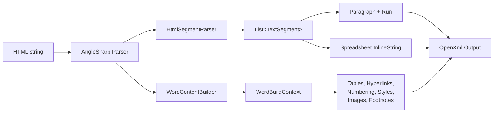
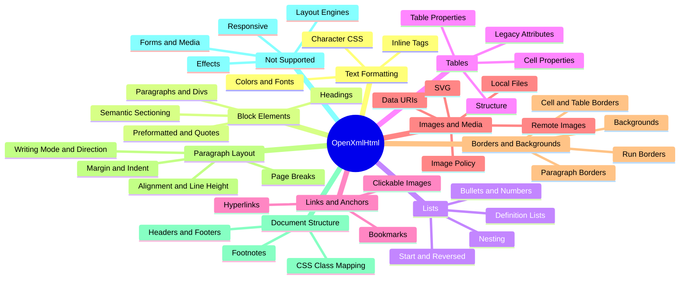
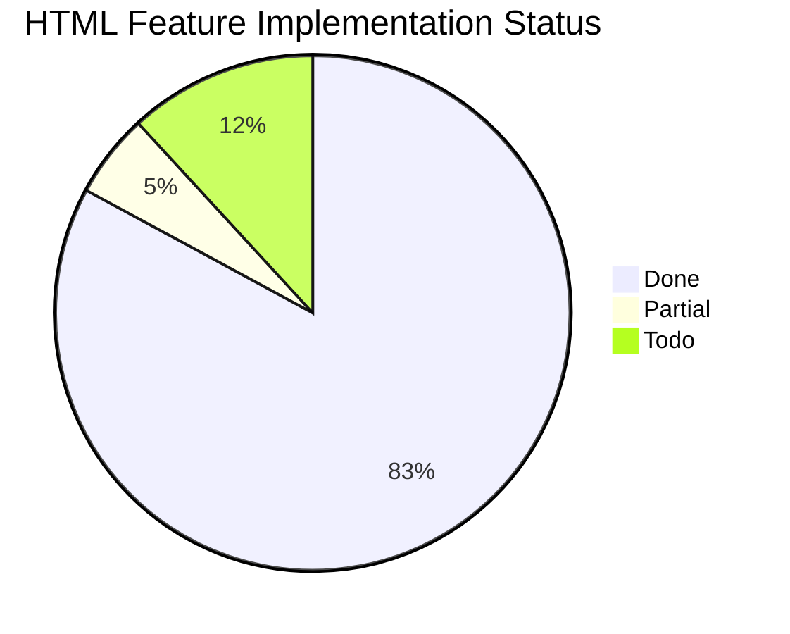

# OpenXmlHtml Feature Matrix

Comprehensive inventory of HTML elements and CSS properties that OpenXmlHtml translates into OpenXml (Word `.docx` and Excel `.xlsx`) — what is supported today, what is partial, and what remains unsupported. This document serves as both reference documentation and a living roadmap.

## How to Read This Document

### Status Markers

Each feature is tagged with one of:

| Marker | Meaning |
|--------|---------|
| `DONE` | Parsed and emitted correctly into the OpenXml output |
| `PARTIAL` | Parsed but with known limitations (details in notes) |
| `TODO` | Not implemented (input is silently ignored or falls back to text) |

### Code Path Key

OpenXmlHtml has two HTML-to-Word code paths. Several features exist only on one side.

| Path | Entry points | Strengths | Limits |
|------|--------------|-----------|--------|
| **Flat segments** | `WordHtmlConverter.ToParagraphs`, `SpreadsheetHtmlConverter` | No `MainDocumentPart` required; cheap for simple rich text; drives xlsx runs | No tables, no real heading/list styles, no hyperlinks, no images, no CSS class mapping |
| **DOM builder** | `WordHtmlConverter.ToElements`, `AppendHtml`, `ConvertToDocx`, `ConvertFileToDocx` | Full feature set: tables, heading styles, real numbering, style mapping, images, footnotes, bookmarks, hyperlinks | Requires a `MainDocumentPart` |

Features below are annotated `[flat]`, `[dom]`, or `[both]` to show which path they work on.

### Audience Key

Notes are tagged for three audiences:

- **Contributors** — Where the code lives, edge cases, internal design
- **Consumers** — What to expect, behavioural limits, workarounds
- **AI** — Which files to modify and which tests to extend

### Keeping This File Current

When adding, modifying, or removing a feature:

1. Update the status (`DONE` / `PARTIAL` / `TODO`)
2. Update the internal class reference and the test file pointer
3. Update the summary statistics at the bottom
4. If you add a new test file, update the mapping table in `CLAUDE.md` as well

---

## Conversion Pipeline

Key internal classes:

| Class | Role |
|-------|------|
| `HtmlSegmentParser` | Flat path: walks AngleSharp DOM into `TextSegment(Text, FormatState)` |
| `WordContentBuilder` | DOM path: walks AngleSharp DOM with `ProcessElement`/`ProcessChildren`, accumulates runs in `WordBuildContext`, flushes paragraphs |
| `ImageResolver` | Resolves `` sources against `HtmlConvertSettings.WebImages` / `LocalImages` policies |
| `WordNumberingBuilder` | Creates `NumberingDefinitionsPart` with bullet and decimal abstract numbering |
| `WordStyleLookup` | Maps CSS class names to Word style IDs from `StyleDefinitionsPart` |
| `ParagraphFormatState` | Holds paragraph-level CSS (margin, text-indent, line-height, text-align, borders) |
| `ColorParser` | Parses hex, 148 named CSS colours, and `rgb`/`rgba` |
| `StyleParser` | Parses inline `style` attributes and CSS lengths (pt/px/em/in/cm/mm → twips) |

---

## Feature Hierarchy

---

## 1. Text Formatting (Inline)

Entry points: `HtmlSegmentParser.ParseFormatting`, `WordContentBuilder.ProcessElement`.
Model: `FormatState` (flat) / `RunFormatState` (DOM).

### 1.1 Inline Tags

#### Bold `DONE` `[both]`

- **HTML**: `<b>`, `<strong>`
- **OpenXml**: `w:b` / `xlsx: <b/>`
- **Test**: `WordBasicTests.BoldTag`, `WordBasicTests.StrongTag`

#### Italic `DONE` `[both]`

- **HTML**: `<i>`, `<em>`, `<cite>`, `<dfn>`, `<var>`
- **OpenXml**: `w:i`
- **Test**: `WordBasicTests.ItalicTag`, `WordMiscElementTests.DfnTag`

#### Underline `DONE` `[both]`

- **HTML**: `<u>`, `<ins>`
- **OpenXml**: `w:u` with `w:val` from `text-decoration-style` (single, double, dotted, dashed, wavy)
- **Test**: `WordUnderlineTests`, `WordBasicTests.InsTag`

> **Consumers**: Spreadsheet runs only emit single or double underline — the dotted/dashed/wavy variants collapse to the closest xlsx style.

#### Strikethrough `DONE` `[both]`

- **HTML**: `<s>`, `<strike>`, `<del>`
- **OpenXml**: `w:strike`
- **Test**: `WordBasicTests.StrikeTag`

#### Superscript / Subscript `DONE` `[both]`

- **HTML**: ``, ``, CSS `vertical-align: super | sub`
- **OpenXml**: `w:vertAlign` (`superscript` / `subscript`)
- **Test**: `WordBasicTests.SupTag`, `WordBasicTests.SubTag`

#### Small `DONE` `[both]`

- **HTML**: `<small>`
- **Behaviour**: 80% font-size reduction
- **Test**: `WordColorAndFontTests.SmallTag`

#### Mark (highlight) `DONE` `[both]`

- **HTML**: `<mark>`
- **OpenXml**: yellow `w:shd` background
- **Test**: `WordBackgroundColorTests.MarkTag`

#### Monospace tags `DONE` `[both]`

- **HTML**: `<code>`, `<kbd>`, `<samp>`
- **Behaviour**: forces `Courier New` font
- **Test**: `WordColorAndFontTests.CodeTag`

#### Break and entities `DONE` `[both]`

- **HTML**: ` `, named and numeric entities
- **Test**: `WordBasicTests.BrTag`, `WordBasicTests.HtmlEntities`

### 1.2 Character CSS

#### `color` `DONE` `[both]`

- **Formats**: hex (#rgb/#rrggbb), 148 CSS named colours, `rgb(r,g,b)`, `rgba(r,g,b,a)` (alpha ignored)
- **OpenXml**: `w:color`
- **Parser**: `ColorParser`
- **Test**: `WordColorAndFontTests`, `ColorParserTests`

#### `background-color` / `background` `DONE` `[both]`

- **OpenXml**: `w:shd` on runs and paragraphs; `w:tcShd` on cells
- **Notes**: Only the colour portion of the `background` shorthand is honoured (no images, no gradients)
- **Test**: `WordBackgroundColorTests`

#### `font-size` `DONE` `[both]`

- **Units**: `pt`, `px` (×0.75), `em` (×12), raw numbers, keywords (`xx-small`…`xx-large`)
- **OpenXml**: `w:sz` (half-points)
- **Parser**: `StyleParser.ParseFontSize`
- **Test**: `StyleParserTests`, `WordColorAndFontTests`

#### `font-family` `DONE` `[both]`

- **OpenXml**: `w:rFonts` ascii/hAnsi
- **Notes**: No `@font-face`; the font must be available when the document is opened
- **Test**: `WordColorAndFontTests.FontFamily`

#### `font-weight`, `font-style` `DONE` `[both]`

- **Values**: `bold`/`bolder`/700/800/900 → bold; `italic`/`oblique` → italic
- **Test**: `WordColorAndFontTests`

#### `text-decoration`, `text-decoration-style` `DONE` `[both]`

- **Values**: `underline`, `line-through`; underline variants `single`, `double`, `dotted`, `dashed`, `wavy`
- **Test**: `WordUnderlineTests`

#### `font-variant: small-caps` `DONE` `[both]`

- **OpenXml**: `w:smallCaps`
- **Test**: `WordSmallCapsTests`

#### `text-transform` `DONE` `[both]`

- **Values**: `uppercase`, `lowercase`, `capitalize` (applied at segment flush time)
- **Test**: `WordTextTransformTests`

#### `writing-mode` / `direction` `DONE` `[dom]`

- **Values**: `vertical-rl`, `vertical-lr`, `direction: rtl`
- **OpenXml**: `w:textDirection` on cells, `w:bidi` on paragraphs
- **Test**: `WordWritingModeTests`

#### Legacy `` attribute `DONE` `[both]`

- **HTML**: ``, ``, ``
- **Test**: `WordColorAndFontTests.FontTag`

---

## 2. Block Elements

### 2.1 Paragraphs and Divs `DONE` `[both]`

- **HTML**: `
`, `
`
- **Test**: `WordBlockTests.ParagraphTag`, `WordBlockTests.DivTag`

### 2.2 Headings `DONE` `[dom]` / `PARTIAL` `[flat]`

- **HTML**: `<h1>`–`<h6>`
- **DOM path**: Mapped to Word built-in heading styles via `WordStyleLookup`
- **Flat path**: Emitted as bold paragraphs (no heading style reference)
- **Test**: `WordHeadingTests`, `WordBlockTests.HeadingTags`

### 2.3 Preformatted `DONE` `[both]`

- **HTML**: `<pre>`
- **Behaviour**: Whitespace preserved, monospace font
- **Test**: `WordBlockTests.PreTag`

### 2.4 Blockquote `DONE` `[both]`

- **HTML**: `<blockquote>`, `cite` attribute creates a footnote (DOM path + MainPart)
- **Test**: `WordBlockTests.BlockquoteTag`, `WordConvertToDocxTests.BlockquoteCite`

### 2.5 Horizontal Rule `DONE` `[both]`

- **HTML**: `
`
- **Behaviour**: Flat path uses em-dash line; DOM path emits a bottom border paragraph
- **Test**: `WordBlockTests.HrTag`

### 2.6 Semantic Sectioning `DONE` `[both]`

- **HTML**: `<section>`, `<article>`, `<nav>`, `<main>`, `<header>`, `<footer>`, `<aside>`, `<figure>`, `<figcaption>`, `
`, `
`, `<address>`
- **Behaviour**: Treated as block containers; no interactive collapse for `
`
- **Test**: `WordMiscElementTests`

### 2.7 Misc inline/metadata tags `DONE` `[both]`

- **HTML**: `<abbr title=>`, `<acronym>`, `<time>`, `<q>`, ``
- **Test**: `WordMiscElementTests`

---

## 3. Lists and Numbering

Entry points: `WordContentBuilder.ProcessList`, `WordNumberingBuilder`.

### 3.1 Unordered Lists `DONE` `[both]`

- **HTML**: `<ul>`, `<li>`
- **DOM path**: Creates a real `NumberingDefinitionsPart` with bullet abstract numbering
- **Flat path**: Emits Unicode bullet prefixes (`●`, `○`, `■` by depth)
- **Test**: `WordListNumberingTests`, `WordBlockTests.UnorderedList`

### 3.2 Ordered Lists `DONE` `[both]`

- **HTML**: `<ol>`, `<li>`
- **DOM path**: Decimal abstract numbering with per-list instance
- **Test**: `WordListNumberingTests`, `WordBlockTests.OrderedList`

### 3.3 List Types `DONE` `[dom]`

- **HTML**: `type="a|A|i|I"`, CSS `list-style-type: disc|circle|square|decimal|lower-alpha|upper-alpha|lower-roman|upper-roman`
- **Test**: `WordListStyleTests`

### 3.4 Start and Reversed `DONE` `[dom]` / `PARTIAL` `[flat]`

- **HTML**: `<ol start="N">`, `<ol reversed>`
- **DOM path**: Honoured via numbering overrides
- **Flat path**: Falls back to computed text prefixes
- **Test**: `WordReversedListTests`, `WordListStyleTests`

### 3.5 Nested Lists `DONE` `[dom]`

- **Behaviour**: Nested `<ul>`/`<ol>` increment `ilvl`; each list is a separate instance so restart is automatic
- **Test**: `WordListNumberingTests.NestedListNumberingRestart`

### 3.6 Definition Lists `DONE` `[both]`

- **HTML**: `<dl>`, `<dt>` (bold), `<dd>` (indented)
- **Test**: `WordMiscElementTests.DefinitionList`

---

## 4. Tables `[dom]`

Entry points: `WordContentBuilder.ProcessTable`.

### 4.1 Structure `DONE`

- **HTML**: `<table>`, `<thead>`, `<tbody>`, `<tfoot>`, `<tr>`, `<td>`, `<th>`, `<caption>`
- **Behaviour**: `<th>` auto-bold; `<caption>` emitted as preceding paragraph
- **Test**: `WordTableTests`

### 4.2 Cell Spanning `DONE`

- **HTML**: `colspan`, `rowspan`
- **OpenXml**: `w:gridSpan`, `w:vMerge`
- **Test**: `WordTableTests.Colspan`, `WordTableTests.Rowspan`

### 4.3 Nested Tables `DONE`

- **Test**: `WordTableTests.NestedTable`

### 4.4 Cell Sizing and Padding `DONE`

- **CSS**: `width` (cell), `height` on `<tr>`, `padding` + per-side padding
- **HTML**: `width`, `cellpadding`
- **Test**: `WordTableStyleTests`, `WordRowHeightTests`

### 4.5 Cell Backgrounds and Borders `DONE`

- **CSS**: `background-color`, `background`, `border`, per-side borders
- **HTML**: `bgcolor`
- **Test**: `WordTableStyleTests`, `WordBorderTests`

### 4.6 Cell Vertical Alignment `DONE`

- **CSS**: `vertical-align: top|center|bottom`
- **OpenXml**: `w:vAlign`
- **Test**: `WordTableStyleTests.CellVerticalAlign`

### 4.7 Vertical Text in Cells `DONE`

- **CSS**: `writing-mode: vertical-rl|vertical-lr`
- **Test**: `WordWritingModeTests.VerticalCell`

### 4.8 Table-level Properties `DONE`

- **CSS**: `width` (percent or absolute), `background-color`, `border`
- **HTML**: `width`, `cellspacing`, `cellpadding`, `bgcolor`, `border`
- **Test**: `WordTableStyleTests`, `WordBorderTests`

### 4.9 `border-collapse` `TODO`

- **Notes**: Word tables are always collapsed; `border-collapse: separate` is ignored.

### 4.10 `<colgroup>` / `<col>` `DONE`

- **HTML**: `<col>`, `<colgroup>`, `span` attribute, `width` attribute (pixels or length), `style="width: ..."`
- **OpenXml**: `w:tblGrid`/`w:gridCol` widths plus a fallback `w:tcW` on cells without explicit CSS width
- **Notes**: Percentage widths are ignored (Word's table grid requires absolute twips). A `<colgroup span="N" width="W">` with no `<col>` children expands to `N` columns.
- **Test**: `WordColgroupTests`

---

## 5. Links and Anchors

### 5.1 External Hyperlinks `DONE` `[dom]` / `PARTIAL` `[flat]`

- **HTML**: `<a href="https://...">`
- **DOM path**: Emits a real `Hyperlink` with relationship
- **Flat path**: Renders the URL in parentheses after the text
- **Test**: `WordAnchorTests.ExternalLink`

### 5.2 Internal Anchors `DONE` `[dom]`

- **HTML**: `<a href="#id">`, `id` attribute creates a bookmark
- **OpenXml**: `w:bookmarkStart`/`w:bookmarkEnd` and internal hyperlink
- **Test**: `WordAnchorTests.InternalLink`, `WordAnchorTests.IdBookmark`

### 5.3 Clickable Images `DONE` `[dom]`

- **HTML**: ``
- **Test**: `WordClickableImageTests`

---

## 6. Images and Media

Entry points: `ImageResolver`, `ImagePolicy`, `HtmlConvertSettings`.

### 6.1 Data URIs `DONE` `[dom]`

- **HTML**: ``
- **Notes**: Always allowed regardless of policy
- **Test**: `WordConvertToDocxTests.DataUriImage`

### 6.2 Remote HTTP(S) `DONE` `[dom]`

- **HTML**: ``
- **Policy**: `HtmlConvertSettings.WebImages` (default `ImagePolicy.Deny()`)
- **Options**: `Deny()`, `AllowAll()`, `SafeDomains(...)`, `Filter(predicate)`
- **Test**: `WordRemoteImageTests`, `ImagePolicyTests`

### 6.3 Local Files `DONE` `[dom]`

- **HTML**: ``, ``
- **Policy**: `HtmlConvertSettings.LocalImages` (default `ImagePolicy.Deny()`)
- **Options**: `SafeDirectories(...)` among others
- **Test**: `WordConvertFileTests`, `ImagePolicyTests`

### 6.4 Image Formats `DONE`

- **Supported**: png, jpg/jpeg, gif, bmp, tiff, svg, webp, ico

### 6.5 SVG `DONE` `[dom]`

- **HTML**: `<svg>` inline or ``
- **Behaviour**: Width/height inferred from `viewBox` when explicit dimensions are missing
- **Test**: `WordConvertToDocxTests.InlineSvg`

### 6.6 Width/Height Attributes `DONE` `[dom]`

- **HTML**: ``
- **Test**: `WordConvertToDocxTests.ImageWidthHeight`

### 6.7 CSS image sizing `DONE` `[dom]`

- **CSS**: `width`, `height` on `` in pt, px, em, in, cm, mm
- **Behaviour**: CSS `width`/`height` takes precedence over the HTML `width=`/`height=` attributes. Percentage values are ignored (Word images need absolute dimensions) and fall through to the HTML attribute if present.
- **Class**: `ImageResolver.ParseImageDimensions`, `StyleParser.ParseLengthToPixels`
- **Test**: `WordImageSizingTests`

> **Consumers**: When only one dimension is specified, the other defaults to 100px — aspect ratio is not inferred from intrinsic image dimensions. `object-fit` and `object-position` are not honoured.

### 6.8 Alt Fallback `DONE` `[both]`

- **Behaviour**: When an image cannot be resolved, `alt` text is emitted as a plain run
- **Test**: `WordEdgeCaseTests.ImageAltFallback`

### 6.9 `srcset` / `<picture>` `TODO`

- **Notes**: Only `src` is honoured; responsive variants are ignored.

---

## 7. Borders and Backgrounds

### 7.1 Run Borders `DONE` `[both]`

- **CSS**: `border` shorthand on inline elements
- **OpenXml**: `w:bdr`
- **Test**: `WordBorderTests.InlineBorder`

### 7.2 Paragraph Borders `DONE` `[both]`

- **CSS**: `border`, `border-top`, `border-right`, `border-bottom`, `border-left`
- **OpenXml**: `w:pBdr`
- **Test**: `WordBorderTests.ParagraphBorder`

### 7.3 Cell and Table Borders `DONE` `[dom]`

- **Styles**: `solid`, `dotted`, `dashed`, `double`, `groove`, `ridge`, `inset`, `outset`, `none`, `hidden`
- **Widths**: `thin`, `medium`, `thick`, explicit lengths (converted to eighths of a point)
- **Test**: `WordBorderTests.CellBorder`, `WordBorderTests.TableBorder`

### 7.4 Backgrounds `DONE` `[both]`

- **CSS**: `background-color`, `background` (colour portion only)
- **OpenXml**: `w:shd` on runs/paragraphs/cells
- **Test**: `WordBackgroundColorTests`

### 7.5 `border-radius`, `outline`, `box-shadow` `TODO`

- **Notes**: Word has no rounded borders for runs/paragraphs and no shadow primitives on text.

---

## 8. Paragraph Layout

Model: `ParagraphFormatState`, applied at flush time.

### 8.1 Margin `DONE` `[both]`

- **CSS**: `margin`, `margin-top|right|bottom|left` in pt, px, em, in, cm, mm
- **OpenXml**: `w:spacing` (before/after), `w:ind` (left/right)
- **Test**: `WordParagraphSpacingTests.Margin`

### 8.2 Text Indent `DONE` `[both]`

- **CSS**: `text-indent`
- **OpenXml**: `w:ind w:firstLine`
- **Test**: `WordParagraphSpacingTests.TextIndent`

### 8.3 Text Alignment `DONE` `[both]`

- **CSS**: `text-align: left|center|right|justify`
- **Test**: `WordParagraphSpacingTests.TextAlign`

### 8.4 Line Height `DONE` `[both]`

- **CSS**: `line-height: <length>` or `<multiplier>`
- **OpenXml**: `w:spacing w:line` with `auto`/`exact` rule
- **Test**: `WordParagraphSpacingTests.LineHeight`

### 8.5 Page Breaks `DONE` `[dom]`

- **CSS**: `page-break-before: always`, `page-break-after: always`
- **OpenXml**: `w:br w:type="page"`
- **Test**: `WordBlockTests.PageBreak`

### 8.6 Writing Mode `DONE` `[dom]`

- **CSS**: `writing-mode: vertical-rl|vertical-lr`, `direction: rtl`
- **Test**: `WordWritingModeTests`

### 8.7 `text-align: inline` on runs `TODO`

- **Notes**: `text-align` only applies at the paragraph level.

### 8.8 `word-spacing`, `letter-spacing` `TODO`

- **Notes**: Not mapped; Word supports `w:spacing` character pitch but it is not parsed.

---

## 9. Document Structure

### 9.1 Headers and Footers `DONE` `[dom]`

- **API**: `WordHtmlConverter.SetHeader(string html)`, `SetFooter(string html)`
- **Behaviour**: Full HTML support including tables, lists, images, hyperlinks
- **Test**: `WordHeaderFooterTests`

### 9.2 Footnotes `PARTIAL` `[dom]`

- **HTML**: `<blockquote cite="text">` emits a footnote with the `cite` value
- **Notes**: There is no explicit `<footnote>` element, and endnotes are not modelled
- **Test**: `WordConvertToDocxTests.BlockquoteCite`

### 9.3 Bookmarks `DONE` `[dom]`

- **HTML**: any element with an `id` attribute becomes a `w:bookmarkStart`/`w:bookmarkEnd` pair
- **Test**: `WordAnchorTests.IdBookmark`

### 9.4 CSS Class → Style Mapping `DONE` `[dom]`

- **Behaviour**: `class="Foo"` is matched (case-insensitive) against the Word document's paragraph and character styles in `StyleDefinitionsPart`
- **Class**: `WordStyleLookup`
- **Test**: `WordStyleMappingTests`

### 9.5 File I/O helpers `DONE` `[dom]`

- **API**: `WordHtmlConverter.ConvertFileToDocx(htmlPath, docxPath)`, `ConvertToDocx(html, stream)`
- **Test**: `WordConvertFileTests`

### 9.6 Table of Contents `TODO`

- **Notes**: No automatic TOC generation from headings.

### 9.7 Fields (`DATE`, `PAGE`, etc.) `TODO`

- **Notes**: Not parsed from HTML. Could be driven by a custom element or attribute in the future.

### 9.8 Sections, Columns, Page Setup `TODO`

- **Notes**: A single default section is emitted; `@page`, columns, and section breaks are not honoured.

---

## 10. Spreadsheet (xlsx) Path

Entry point: `SpreadsheetHtmlConverter.ToInlineString`.

### 10.1 Inline formatting in cells `DONE`

- **Behaviour**: HTML is parsed to `TextSegment`s and emitted as a spreadsheet `InlineString` with a `Run` per segment. Supports bold, italic, underline (single/double/dotted/dashed/wavy → collapsed to available xlsx styles), strikethrough, super/sub, color, background, font-size, font-family, small-caps, text-transform.
- **Test**: `Spreadsheet*Tests`

### 10.2 Tables, images, hyperlinks in cells `TODO`

- **Notes**: Spreadsheet path is inline-text-only. Block structure, tables, images and hyperlinks are flattened or dropped.

---

## 11. Not Supported

These categories are intentionally out of scope because Word/Excel does not model them or the mapping would be lossy.

### 11.1 Layout Engines

- `display` values beyond implicit block/inline (no `flex`, `grid`, `table-cell` override, `contents`, `inline-block`)
- `position` (`static`/`relative`/`absolute`/`fixed`/`sticky`)
- `float`, `clear`
- `z-index`, stacking contexts
- `overflow`, `clip-path`
- `aspect-ratio`, `object-fit`, `object-position`

### 11.2 Visual Effects

- `border-radius`, `outline`
- `box-shadow`, `text-shadow`, `drop-shadow()`
- `filter`, `backdrop-filter`
- `opacity`
- `transform` (`rotate`, `scale`, `skew`, `matrix`, `perspective`)
- `transition`, `animation`, `@keyframes`
- `background-image`, `linear-gradient`, `radial-gradient`, `conic-gradient`

### 11.3 Typography Gaps

- `@font-face` (fonts must already be available when the docx is opened)
- `word-spacing`, `letter-spacing`, `font-kerning`, `font-feature-settings`
- `text-shadow`, `text-stroke`
- `text-overflow`, `white-space` variants other than `<pre>`
- `hyphens`
- CSS custom properties (variables) and `calc()`
- `font-variant` beyond `small-caps`

### 11.4 Selectors and At-Rules

- Only inline `style=` attributes and `class=` mapping are honoured
- No external or embedded stylesheets (`<link rel="stylesheet">`, `<style>`)
- No pseudo-classes (`:hover`, `:nth-child`, `:first-line`, …)
- No pseudo-elements (`::before`, `::after`, `::marker`)
- No `@media`, `@supports`, `@container`, `@layer`, `@import`
- No cascade or specificity resolution

### 11.5 Interactive and Form Controls

- `<input>`, `<textarea>`, `<select>`, `<option>`, `<button>`, `<label>`, `<fieldset>`, `<legend>`, `<meter>`, `<progress>`, `<output>`, `<datalist>`
- `
`/`
` render as static blocks (no disclosure toggle)
- `<dialog>`
- Event handlers, ARIA roles, and `tabindex` are ignored

### 11.6 Embedded Media

- `<video>`, `<audio>`, `<source>`, `<track>`
- `<canvas>`
- `<iframe>`, `<embed>`, `<object>`, `<param>`
- `<picture>`, `<source srcset>`

### 11.7 Ruby, Math, and Exotic Tags

- `<ruby>`, `<rt>`, `<rp>`, `<rb>`, `<rtc>`
- `<bdi>`, `<bdo>` (direction only partially respected via `direction: rtl`)
- `<math>` / MathML
- `<marquee>`, `<blink>` (obsolete)
- `<noscript>`, `<script>`, `<template>`, `<slot>`

### 11.8 Responsive Features

- Media queries, container queries
- `srcset`, `<picture>` sources
- `vw`/`vh`/`vmin`/`vmax` units (only absolute-ish units are parsed)
- Any notion of a "viewport"

> **Consumers**: Word is a paginated, flow-oriented format. Responsive layout primitives have no analog and are ignored rather than approximated.

---

## 12. Summary

### Feature Count by Category

| Category | Done | Partial | Todo | Total |
|----------|------|---------|------|-------|
| 1. Text Formatting | 17 | 0 | 0 | 17 |
| 2. Block Elements | 7 | 1 | 0 | 8 |
| 3. Lists and Numbering | 5 | 1 | 0 | 6 |
| 4. Tables | 9 | 0 | 1 | 10 |
| 5. Links and Anchors | 2 | 1 | 0 | 3 |
| 6. Images and Media | 8 | 0 | 1 | 9 |
| 7. Borders and Backgrounds | 4 | 0 | 1 | 5 |
| 8. Paragraph Layout | 6 | 0 | 2 | 8 |
| 9. Document Structure | 4 | 1 | 3 | 8 |
| 10. Spreadsheet Path | 1 | 0 | 1 | 2 |
| **Total** | **63** | **4** | **9** | **76** |

### Coverage

**Overall coverage: 83% fully implemented, 5% partial, 12% remaining.** Numbers exclude the "Not Supported" section, which lists features that are out of scope by design.

### Priority Areas

1. **Endnotes and explicit `<footnote>` markup** — currently overloaded onto `blockquote cite`
2. **Sections, columns, page setup** — common in long-form document conversion
3. **Spreadsheet hyperlinks and images** — xlsx path is currently inline-text only
4. **Table of contents from headings** — natural fit once heading styles are in place
5. **CSS class lookup from embedded `<style>`** — today only external Word styles are matched
